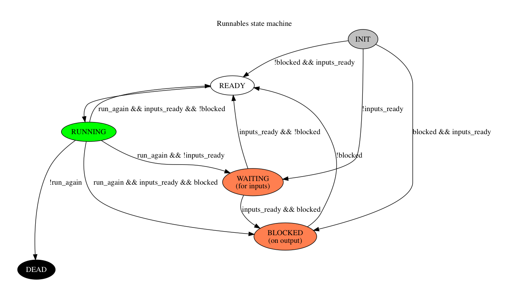

[](https://travis-ci.org/andrewdavidmackenzie/flow)

# Flow
Flow is a library and cli creation and execution of asynchronous, data-driven, programs. See [Flow Programming] section below.

# Inspirations
* Structured Analysis (and Design) from my work with it in HP the '80s!
* Trace based compiler instruction scheduling work done at MultiFlow and later HP by Josh Fisher, Paolo Faraboschi and others
* UNIX pipes
* Amoeba distributed OS by Andrew Tannenbaum that made a collaborating network of computers appear as one to the user of a "Workstation"
* The transputer and it's Occam parallel programming language (which I studied at Univerity)
* Yahoo Pipes!

# Non-Inspirations
This is a list of things I've heard about along the way and deliberately avoided learning more about, to avoid contaminating my ideas but
also to avoid demotivating myself by finding out "it's been done already, nothing new here, move on"
* Data flow programming
* Tensor Flow (this was hard not to dive into)
* C.A.R. Hoare - COmmunicating Sequential Processes (O.M.G. All my thoughts, reduced to algebra!!!)


# Project Idea

# Future Plans
Visual building of apps by creating and combining existing flows (which contain Functions and Values) into a hierarchy.

## Pre-requisites

You need [Git](https://git-scm.com) and [Node.js](https://nodejs.org/en/download/) (which comes with [npm](http://npmjs.com)) installed.

The project uses the electron-forge packaging tool which you can install with:
```
npm install -g electron-forge
```

See https://github.com/electron-userland/electron-forge for more details on how to use electron-forge.

## To build

With pre-requisites installed, from your command line:

```bash
# Clone this repository
git clone https://github.com/andrewdavidmackenzie/flow.git
# Go into the repository directory
cd flow
# Build and run the app
make
```

### Dependencies
You need to have gtk3 installed to build the gtk project (which is just a skeleton at the moment).

On Debian and Ubuntu: sudo apt-get install libgtk-3-dev
On Fedora: sudo dnf install gtk3-devel glib2-devel
On Mac OS X: brew install gtk+3

## Packaging the app

You can package easily for the platform you are currently running on with:

```
make package
```

Flow Programming
##

This is an exploration project of some ideas I have for programming using a description of data flows and transformations.

I'd like a visual app to create the app descriptions (producing a program description in a set of yaml files at the moment) and also be able to run them, as well as CLI tools to validate and run such a program.

I plan to try and develop a few trivial, and then simple, and later maybe more complicated sample programs to tease out the initial complexities.

The running of the algorithms would just be to demonstrate that the method can be used to describe the programs tried, and will not be performant, or anything like a compiled solution that would be required in a final solution.

Flow Descriptions
###

Flows may have zero or more inputs, outputs, values (constants), functions, and other sub-flows.
flow = [input] + [output] + [flow] + [values] + [functions]

## Runtime semantics
I have a lot to document here... but the basic idea is a "network" of independant "runnables" (functionr or values)
than once inputs are available and not blocked on output by anothe rrunnable, can all run independently.

Here is the finiate state machine for a given runnable:


## License

MIT
